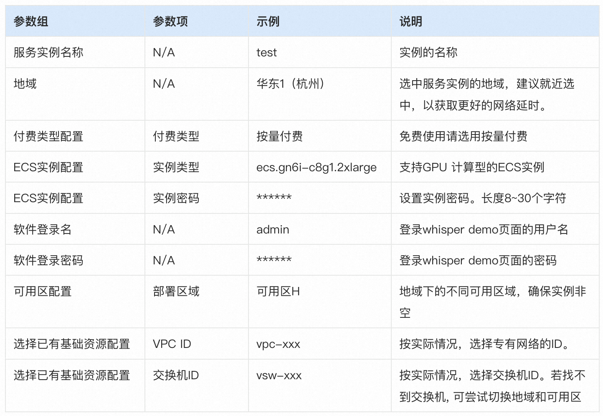

# OpenAI Whisper 计算巢部署使用文档
## 概述

使用计算巢，您可以一键秒级部署 Whisper，即刻开启AIGC之旅。不使用计算巢，您可能需要花费数小时、甚至更长的时间在环境准备、服务部署上。基于计算巢可以极大提升你的工作效率，把精力集中在业务逻辑之上。

拥有ChatGPT语言模型的OpenAI公司，开源了 Whisper 自动语音识别系统，OpenAI 强调 Whisper 的语音识别能力已达到人类水准。

Whisper 是一个通用的语音识别模型，它使用了大量的多语言和多任务的监督数据来训练，能够在英语语音识别上达到接近人类水平的鲁棒性和准确性。Whisper 还可以进行多语言语音识别、语音翻译和语言识别等任务。Whisper 的架构是一个简单的端到端方法，采用了编码器-解码器的Transformer模型，将输入的音频转换为对应的文本序列，并根据特殊的标记来指定不同的任务。

## 实例说明
Whisper 部署的为社区开源版本，源码参考 [Hugging Face Repo](https://huggingface.co/spaces/sanchit-gandhi/whisper-large-v2/tree/main)，目前可以选择的实例规格如下:

| 规格族                  | vCPU与内存       | 系统盘 | GPU/FPGA             |
|-------------------------|------------------|--------|----------------------|
| ecs.gn7i-c16g1.4xlarge  | 16 vCPU 60 GiB   | 200G   | 1 * NVIDIA A10 (24G) |
| ecs.gn7i-c32g1.8xlarge  | 32 vCPU 188 GiB  | 200G   | 1 * NVIDIA A10 (24G) |
| ecs.gn7i-c32g1.16xlarge | 64 vCPU 376 GiB  | 200G   | 2 * NVIDIA A10 (24G) |
| ecs.gn7i-c32g1.32xlarge | 128 vCPU 752 GiB | 200G   | 4 * NVIDIA A10 (24G) |

## 部署流程

### 0. 准备工作

在正式开始使用前，您需要一个阿里云账号，对ECS、VPC等资源进行访问和创建操作。

- 若您使用个人账号，可以直接创建服务实例
- 若您使用RAM用户创建服务实例，且是第一次使用阿里云计算巢
  - 需要在创建服务实例前，对使用的RAM用户的账号添加相应资源的权限。添加RAM权限的详细操作，请参见 [为RAM用户授权](https://help.aliyun.com/document_detail/121945.html)。
  - 且需要授权创建关联角色，参考下图，选中 **同意授权并创建关联角色**

### 1. 部署入口
您可以在阿里云计算巢自行搜索，也可以通过下述部署链接快速到达:
[部署链接](https://computenest.console.aliyun.com/vendor/cn-hangzhou/serviceDetail/service-51e7e7bf804d44d4bcd0/1)

### 2. 创建Whisper服务实例

#### 2.1 参数列表
您在创建服务实例的过程中，需要配置服务实例信息的参数列表，具体如下:

#### 2.2 具体步骤
创建服务按如下步骤进行，参考下图：

1. 创建实例名称
2. 选择地域，如下图中 "华东1（杭州）"

3. 选择付费类型："按量付费" 或 "包年包月"
4. 选择实例类型 & 配置实例的密码

6. 输入软件登录用户名&登陆密码
7. 点击"下一步:确认订单"按钮，进入订单确认页面

8. 勾选"服务条款"中的复选框
11. 点击"立即创建"按钮，即可创建Whisper的服务实例

### 3. 启动Whisoer服务

查看服务实例：服务实例创建成功后，部署时间约为5分钟。等待服务实例变为「已部署」状态，点击"详情"按钮，即可进入服务实例详情页面，如下图所示:

进入服务实例后，可以在页面上获取"登录地址"：

点击登录地址后，输入创建服务实例配置的软件用户名&密码，即可访问已经部署好的Whisper Web页面。建议新手先通过Whisper Web，使用demo功能快速上手：

用户可以上传音频文件，点击Transcribe，即可将音频转换成文字

### 更多示例

更多功能请参考：[Whisper使用文档](https://github.com/openai/whisper)

期待您更深入的探索，也欢迎一起实践并补充相应案例到本文档。